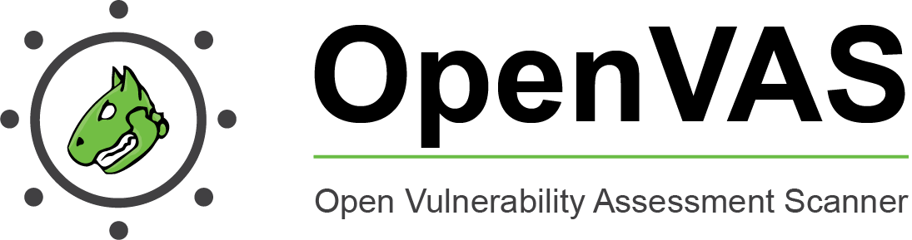
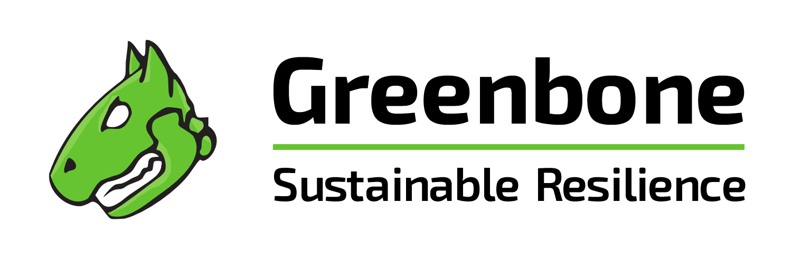
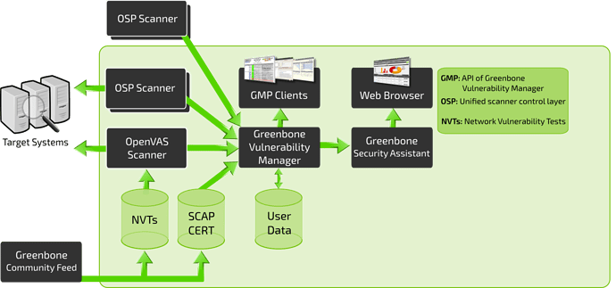
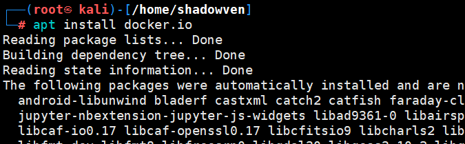
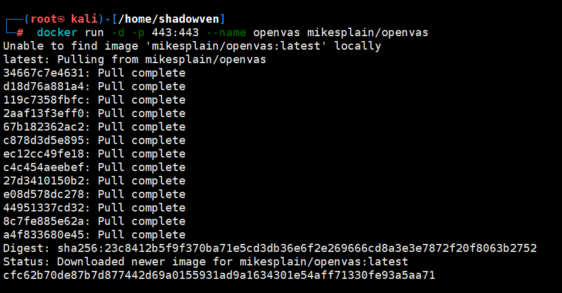
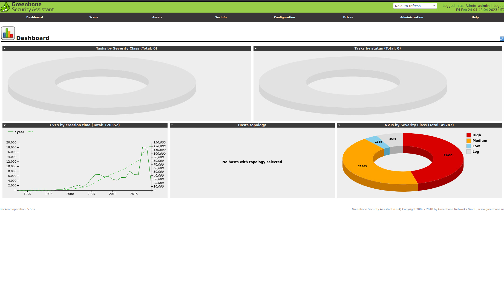
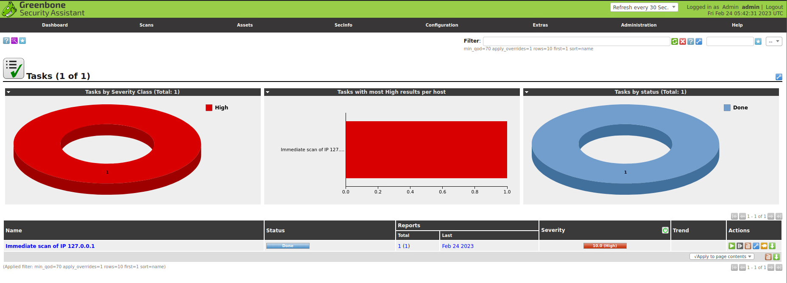
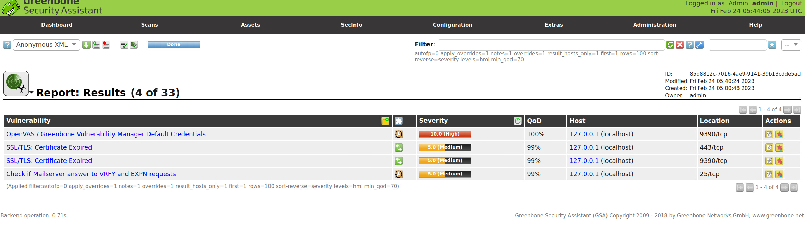
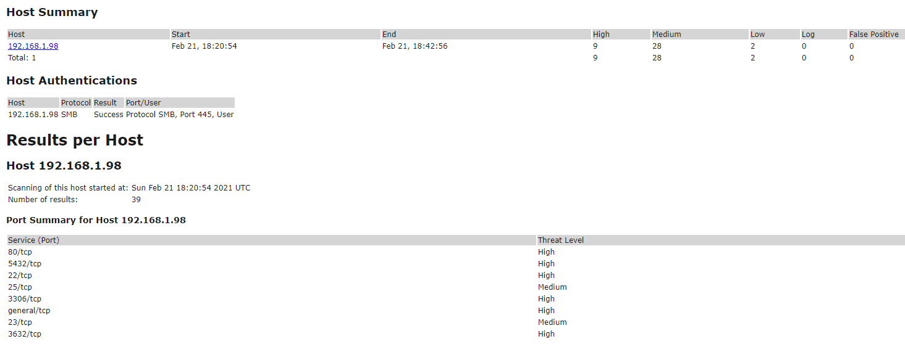
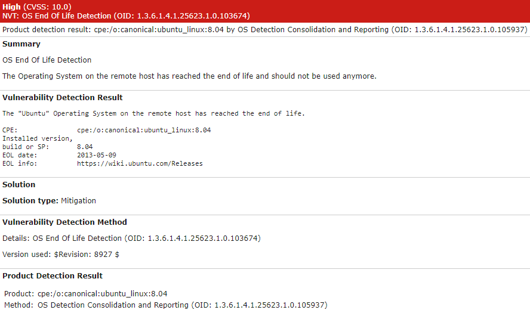

# OpenVAS
Open Vulnerability Assessment Scanning

## 1. Introduction

OpenVAS常用于扫描Endpoiont和网络应用程序以识别和漏洞检测。It is commonly used by corporations as part of their mitigation solutions to quickly identify any gaps in their production or even development servers or applications. 虽然不是万能的，但用来应付常见漏洞没啥问题。

From the OpenVAS GitHub repository "This is the Open Vulnerability Assessment Scanner (OpenVAS) of the Greenbone Vulnerability Management (GVM) Solution. It is used for the Greenbone Security Manager appliances and is a full-featured scan engine that executes a continuously updated and extended feed of Network Vulnerability Tests (NVTs)."

## 2. GVM Framework Architecture 

上文提到过OpenVAS是基于GreenBone Vulnerability Management(GVM) 解决方案构建的的其中一款应用。

OpenVAS is a service within a larger framework of services known as Greenbone Vulnerability Management (GVM). We will break down the services that make up the framework and their roles. 

如上图所示，GVM框架是由许多模块组成的，但大致可以将其分解为三个不同的部分: Front-End, Back-End, and Vulnerability/Information feed. 

- **Vulnerability/Information Feed (NVT, SCAP CERT, User Data, Community Feed)**

    This section will contain all information and vulnerability tests that come from the Greenbone Community Feed that will be the main baseline for testing against systems.  This can also include User Data provided by the user in place of Greenbone NVTs and SCAP CERTs. 

- **Back-End (OSP, OpenVAS, Targets)**

    The back-end infrastructure is what will be actually conducting all of the vulnerability scanning and processing data and NVTS through OpenVAS and GVM. Greenbone Vulnerability Manager will be the middle man between the scanners and the front-end user interfaces. 

- **Front-End (GSA, Web Interfaces)**

    This is what you interact with when you navigate to OpenVAS in your browser. The web interfaces are built off of the Greenbone Security Assistant and make life easier for an analyst or operator when working with OpenVAS or other forms of scanners through the GVM.

For more information about the GVM framework architecture check out this forum post https://community.greenbone.net/t/about-gvm-10-architecture/1231.

## 3. Installing OpenVAS 

OpenVAS有多种安装方法，推荐在Docker容器中运行 as we don't have to worry about a lot of the setup or errors that we may run into with other installation methods.

### Option 1: Install from Kali/OpenVAS repositories

从库中安装有时比较简单，也可能非常头大。对于OpenVAS来说，安装的难度不等，可能需要调试许多配置。如果有兴趣，请查看下面的指南：

    https://websiteforstudents.com/how-to-install-and-configure-openvas-on-ubuntu-18-04-16-04/
    https://www.agix.com.au/installing-openvas-on-kali-in-2020/

### Option 2: Install from Source

有亿点点麻烦，有兴趣的话请移步[INSTALL.MD](https://github.com/greenbone/openvas-scanner/blob/master/INSTALL.md)。

### Option 3:Run from Docker (推荐)

1. 安装Docker(如果没有)`apt install docker.io`

    

2. Pull the docker container and then run the container.
   
    `docker run -d -p 443:443 --name openvas mikesplain/openvas`

    

3. 在浏览器中访问`https://127.0.0.1`
   Below are the default credentials to access OpenVAS/GVM:
   1. Username: `admin`
   2. Password: `admin`

    

## 4. Initial Configuration 

1. 点紫色方块配置了向导, 建议扫一下 127.0.0.1 检测安装配置是否正确。
    扫描后如下图所示：
    

2. 扫描完成后，可以导航到 *Scans > Reports*，并点击之前任务中新创建的报告,如果配置正确，应该看到三个不同的漏洞报告。

    

## 5. Scanning Infrastructure 

Now everything works well， 开始进行漏扫

1. Creating a Task
   
    To create a configurable task navigate to the star icon in the upper right-hand corner of the Tasks dashboard and select New Task. 
    

    Once you select New Task from the dropdown you will be met with a large pop-up with many options. We will break down each of the options sections and what they can be used for.

    先看一下具体扫描配置：

    1. **Name**: Allows us to set the name the scan will be known as inside of OpenVAS
    2. **Scan** Targets: The targets to scan, can include Hosts, Ports, and Credentials. To create a new target you will need to follow another pop-up, this will be covered later in this task.
    3. **Scanner**: The scanner to use by default will use the OpenVAS architecture however you can set this to any scanner of your choosing in the settings menu.
    4. **Scan** Config: OpenVAS has seven different scan types you can select from and will be used based on how you aggressive or what information you want to collect from your scan.

2. Scoping a New Target

## 6. Reporting and Continuous Monitoring 

## 7.More

For more information and advance technical you can find the Greenbone Technology Documentation,[here](https://docs.greenbone.net/)