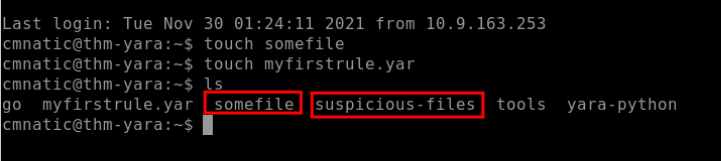
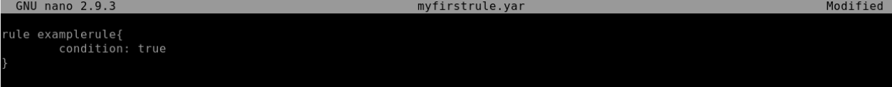
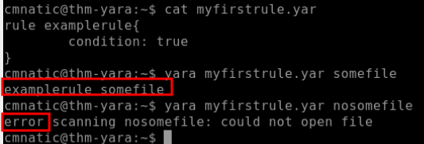

# Yara

## 1. Introduction

Yara (Yet Another Ridiculous Acronym) is and its importance in infosec today. Yara was developed by Victor M. Alvarez ([@plusvic](https://twitter.com/plusvic)) and (@VirusTotal)[https://twitter.com/virustotal]. Check the GitHub repo (here)[https://github.com/virustotal/yara].

## 2. What is Yara?

### **All about Yara**

*"The pattern matching swiss knife for malware researchers (and everyone else)" (Virustotal., 2020)*

Yara can identify information based on both binary and textual patterns, such as hexadecimal and strings contained within a file.

Rules are used to label these patterns. For example, Yara rules are frequently written to determine if a file is malicious or not, based upon the features - or patterns - it presents. Strings are a fundamental component of programming languages. Applications use strings to store data such as text.

For example, the code snippet below prints "Hello World" in Python. The text "Hello World" would be stored as a string.

`print("Hello World!")`

We could write a Yara rule to search for "hello world" in every program on our operating system if we would like. 

### **Why does Malware use Strings?**

Malware, just like our "Hello World" application, uses strings to store textual data. Here are a few examples of the data that various malware types store within strings:

| Type | Data | Description |
| :---        |    :----:   |          ---: |
| Ransomware | [12t9YDPgwueZ9NyMgw519p7AA8isjr6SMw](https://www.blockchain.com/btc/address/12t9YDPgwueZ9NyMgw519p7AA8isjr6SMw) | Bitcoin Wallet for ransom payments |
| Botnet | 12.34.56.7 | The IP address of the Command and Control (C&C) server |

## 3. Download and Installation

-Linux

`apt-get install yara apt-get install python-yara /pip install yara `

-Windows

```https://www.dropbox.com/sh/umip8ndplytwzj1/AADdLRsrpJL1CM1vPVAxc5JZa?dl=0&lst=```

```pip install yara-python```

## 4. Introduction to Yara Rules

### Your First Yara Rule

The proprietary language that Yara uses for rules is fairly trivial to pick up, but hard to master. This is because your rule is only as effective as your understanding of the patterns you want to search for.

Using a Yara rule is simple. Every `yara` command requires two arguments to be valid, these are:
1) The rule file we create
2) Name of file, directory, or process ID to use the rule for.

Every rule must have a name and condition.

For example, if we wanted to use "myrule.yar" on directory "some directory", we would use the following command:
`yara myrule.yar somedirectory`

Note that **.yar** is the standard file extension for all Yara rules. We'll make one of the most basic rules you can make below.

1. Make a file named "**somefile**" via `touch somefile`
2. Create a new file and name it "**myfirstrule.yar**" like below:

    

3. Open the "myfirstrule.yar" using a text editor such as `nano` and input the snippet below and save the file:

    ```
    rule examplerule {
            condition: true
    }
    ```
    

The name of the rule in this snippet is `examplerule`, where we have one condition - in this case, the **condition** is `condition`. As previously discussed, every rule requires both a name and a condition to be valid. This rule has satisfied those two requirements.

Simply, the rule we have made checks to see if the file/directory/PID that we specify exists via `condition: true`. If the file does exist, we are given the output of `examplerule`

Let's give this a try on the file "somefile" that we made in step one:
`yara myfirstrule.yar somefile`

If "somefile" exists, Yara will say `examplerule` because the pattern has been met - as we can see below:

If "somefile" exists, Yara will say examplerule because the pattern has been met - as we can see below and If "somefile" exists, Yara will say examplerule because the pattern has been met - as we can see below:



## 5.  Expanding on Yara Rules 

### **Yara Conditions Continued...**

Checking whether or not a file exists isn't all that helpful. After all, we can figure that out for ourselves...Using much better tools for the job.

Yara has a few conditions, which I encourage you to read here at your own leisure. However, I'll detail a few below and explain their purpose.

| Keyword |
| ----------- |
| Desc |
| Meta |
| Strings |
| Conditions |
| Weight |

### **Meta**
This section of a Yara rule is reserved for descriptive information by the author of the rule. For example, you can use desc, short for description, to summarise what your rule checks for. Anything within this section does not influence the rule itself. Similar to commenting code, it is useful to summarise your rule.


### **Strings**

Remember our discussion about strings in Task 2? Well, here we go. You can use strings to search for specific text or hexadecimal in files or programs. For example, say we wanted to search a directory for all files containing "Hello World!", we would create a rule such as below:

```
rule helloworld_checker{
	strings:
		$hello_world = "Hello World!"
}
```

We define the keyword `Strings` where the string that we want to search, i.e., "Hello World!" is stored within the variable `$hello_world`

Of course, we need a condition here to make the rule valid. In this example, to make this string the condition, we need to use the variable's name. In this case, `$hello_world`:

```
rule helloworld_checker{
	strings:
		$hello_world = "Hello World!"

	condition:
		$hello_world
}
```
Essentially, if any file has the string "Hello World!" then the rule will match. However, this is literally saying that it will only match if "Hello World!" is found and will not match if "*hello world*" or "*HELLO WORLD*."

To solve this, the condition `any of them` allows multiple strings to be searched for, like below:

```
rule helloworld_checker{
	strings:
		$hello_world = "Hello World!"
		$hello_world_lowercase = "hello world"
		$hello_world_uppercase = "HELLO WORLD"

	condition:
		any of them
}
```

Now, any file with the strings of:
1. Hello World!
2. hello world
3. HELLO WORLD

Will now trigger the rule.

### **Conditions**

We have already used the true and any of them condition. Much like regular programming, you can use operators such as:

        <= less than or equal to
        >= more than or equal to
        != not equal to

For example, the rule below would do the following:

```
rule helloworld_checker{
	strings:
		$hello_world = "Hello World!"

	condition:
        #hello_world <= 10
}
```
The rule will now:

1. Look for the "Hello World!" string
2. Only say the rule matches if there are less than or equal to ten occurrences of the "Hello World!" string

### **Combining keywords**

Moreover, you can use keywords such as:

        and
        not
        or 

To combine multiple conditions. Say if you wanted to check if a file has a string and is of a certain size (in this example, the sample file we are checking is __less than__ <10 kb and has "Hello World!" you can use a rule like below:

```
rule helloworld_checker{
	strings:
		$hello_world = "Hello World!" 
        
        condition:
	        $hello_world and filesize < 10KB 
}
```

### 6. Yara Modules

### **Integrating With Other Libraries**

Frameworks such as the [Cuckoo Sandbox](https://cuckoosandbox.org/) or [Python's PE Module](https://pypi.org/project/pefile/) allow you to improve the technicality of your Yara rules ten-fold.


### **Cuckoo**

Cuckoo Sandbox is an automated malware analysis environment. This module allows you to generate Yara rules based upon the behaviours discovered from Cuckoo Sandbox. As this environment executes malware, you can create rules on specific behaviours such as runtime strings and the like.


### **Python PE**
Python's PE module allows you to create Yara rules from the various sections and elements of the Windows Portable Executable (PE) structure.


Examining a PE file's contents is an essential technique in malware analysis; this is because behaviours such as cryptography or worming can be largely identified without reverse engineering or execution of the sample.

## 7. Other tools and Yara

### Yara Tools

Knowing how to create custom Yara rules is useful, but luckily you don't have to create many rules from scratch to begin using Yara to search for evil. There are plenty of GitHub [resources](https://github.com/InQuest/awesome-yara) and open-source tools (along with commercial products) that can be utilized to leverage Yara in hunt operations and/or incident response engagements. 

LOKI is a free open-source IOC (Indicator of Compromise) scanner created/written by Florian Roth.

Based on the GitHub page, detection is based on 4 methods:

1. File Name IOC Check
2. Yara Rule Check __(we are here)__
3. Hash Check
4. C2 Back Connect Check

There are additional checks that LOKI can be used for. For a full rundown, please reference the [GitHub readme](https://github.com/Neo23x0/Loki/blob/master/README.md).

LOKI can be used on both Windows and Linux systems and can be downloaded [here](https://github.com/Neo23x0/Loki/releases).

### LOKI

### THOR

### FENRIR

### YAYA(Yet Another Yara Automaton)